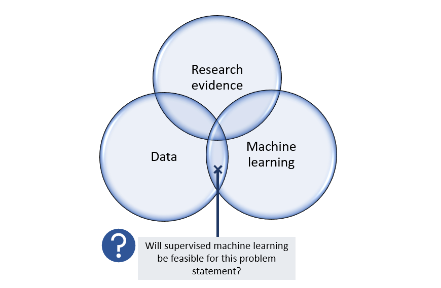

# Previous projects

## [Supervised Model Dashboard](https://github.com/py3lee/supervised_ml_dashboard)

Artificial intelligence and machine learning are buzzwords within healthcare nowadays. However, not enough people within the industry appreciate that it takes a combination of clinical research evidence, good quality large-scale datasets and machine learning technologies with the associated software infrastructure for us to harness the benefits of technology within healthcare.  Technology has to be utilized with the right intention and with the right systems in place for an appropriate problem statement. 

Even if the prerequisite blocks are in place, someone would still need to explore the quality of the dataset and establish a baseline machine learning model to determine whether supervised machine learning would be feasible for a current problem statement. These prerequisite blocks include an appropriate problem statement that can be addressed by machine learning, having datasets in an appropriate format (i.e. tabular datasets) with sufficient quality and quantity, as well as the underlying clinical research evidence for the predictors included in the model. 

The [Supervised Model Dashboard](https://github.com/py3lee/supervised_ml_dashboard) was designed to provide some guidance to the question "Will supervised machine learning be feasible for this problem statement?".  Given an existing preprocessed/cleaned tabular dataset and an appropriate predictive modelling problem statement, it allows a user to quickly assess if a dataset is suitable for supervised machine learning; it can train and then display the evaluation results of a selected baseline supervised machine learning model and provide some explanations for the model predictions. 

---

## [Robotic Process Automation (RPA)](https://github.com/py3lee/rpa)

Robotic Process Automation, or [RPA](https://en.wikipedia.org/wiki/Robotic_process_automation), is a type of software technology that helps to automate repetitive tasks.  It is useful for any repetitive computer-related task that is based on known rules, and which can be broken down or operationalized into a series of steps. RPA can be helpful to automate repetitive tasks related to the use of legacy software systems that are entrenched within the company culture, and too expensive to change. 

A single tool alone is sometimes insufficient to solve a problem. By combining a [free RPA tool](https://aisingapore.org/tagui/) with other python packages, we can leverage on existing python packages to process excel files, read passwords from Windows Credentials, or send email alerts when a certain specified price threshold is reached. All this can be packaged into a simple program that can be trigged by Windows Task Scheduler at set times -  an [unattended RPA bot](https://github.com/py3lee/rpa). 

Can we leverage on technology to minimize the repetitive computer-related administrative work in healthcare, so that we can focus our time on our patients instead? 

---

## Data visualization and analysis

- [Malaria](https://github.com/py3lee/malaria): Data analysis and visualization, data pipeline construction in python and R using 3 malaria datasets  

- [Google Analytics Capstone Case Study](https://github.com/py3lee/google_analytics_capstone) : Data analysis and visualization in R using the 2021 public Chicago [Divvy Bicycle Sharing data](https://divvy-tripdata.s3.amazonaws.com/index.html)  

- [Tableau Dashboard](https://public.tableau.com/app/profile/khatijah6219/viz/VAERSReportsforCOVID-19mRNAVaccines/VAERSStory) visualization based on VAERS Reports for COVID-19 mRNA Vaccines

---

## Online calculator 

[Model-based Physical Frailty Phenotype](https://py3lee.shinyapps.io/frailty_shiny/), an online calculator created using the R Shiny framework.

---

I'm still working on adding content to this repository.

Any comments, feedback and suggestions for improvement are welcome - please do drop me a message!  

Thank you! 