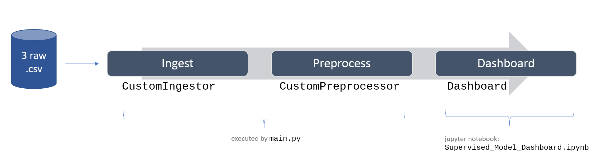

# Workflow

# Supervised Model dashboard

This dashboard displays the following for a Supervised machine learning model:

**Binary classification problems**: 

- model performance scores, 
- Receiver operating characteristic curve,
- Precision-Recall curve,   
- Classification Report, 
- Confusion Matrix, 
- Model hyperparameters, 
- Sample of predicted labels with features and true labels,
- Impurity-based feature importance scores,
- Summary plot of SHapley Additive exPlanations (SHAP) values,
- Bivariate plots of Target vs Features for Top N features

**Regression problems**:

- model performance scores,
- Model hyperparameters, 
- Sample of predicted labels with features and true labels,
- Impurity-based feature importance scores,
- Summary plot of SHapley Additive exPlanations (SHAP) values,
- Bivariate plots of Target vs Features for Top N features

## Setup

The Dashboard displays from a Jupyter notebook. 

Open the Supervised Model Dashboard notebook by navigating to `notebook` > `Supervised_Model_Dashboard.ipynb`

Run all cells to display the dashboard. 

Check out the detailed [user guide](user_guide/Supervised_Model_Dashboard.md) for further details on the configuration settings, setup files, step-by-step walkthrough of all the displayed content, as well as the process flows for the classes. 

## EDA 

See the respective Exploratory Data Analysis (EDA) notebooks (`notebook` > `EDA`) for the rationale and justification of the preprocessing steps in the CustomIngestor and CustomPreprocessor classes.   